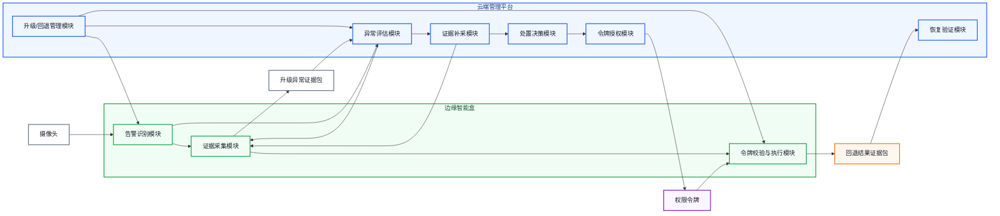

```mermaid
flowchart LR

C["摄像头"] --> R

subgraph edge["边缘智能盒"]
    direction LR
    R["告警识别模块"] --> E["证据采集模块"] --> K["令牌校验与执行模块"]
end

subgraph cloud["云端管理平台"]
    direction LR
    U["升级/回退管理模块"] --> A["异常评估模块"] --> S["证据补采模块"] --> D["处置决策模块"] --> T["令牌授权模块"]
    V["恢复验证模块"]
end

E --> Pkg["升级异常证据包"]
Pkg --> A

R --> A
A --> E
S --> E

T --> Token["权限令牌"]
Token --> K

U --> R
U --> K

K --> Result["回退结果证据包"]
Result --> V

classDef cloudBox fill:#EEF6FF,stroke:#2563EB,stroke-width:2px,color:#111827;
classDef edgeBox fill:#F0FDF4,stroke:#16A34A,stroke-width:2px,color:#111827;
classDef dataBox fill:#FFFFFF,stroke:#64748B,stroke-width:2px,color:#111827;
classDef tokenBox fill:#FAF5FF,stroke:#7E22CE,stroke-width:2px,color:#111827;
classDef resultBox fill:#FFF7ED,stroke:#F97316,stroke-width:2px,color:#111827;

class U,A,S,D,T,V cloudBox;
class R,E,K edgeBox;
class C,Pkg dataBox;
class Token tokenBox;
class Result resultBox;

style cloud fill:#EFF6FF,stroke:#2563EB,stroke-width:2px,color:#1E3A8A
style edge fill:#F0FDF4,stroke:#16A34A,stroke-width:2px,color:#14532D
```